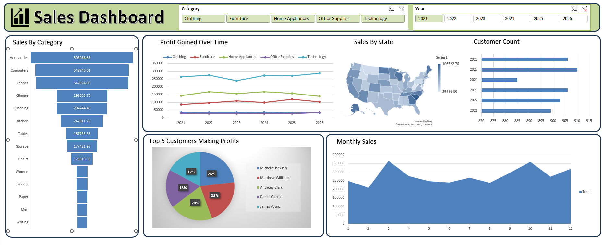

# 📊 E-Commerce Sales Analytics & Dashboard

## 📌 Project Overview

This project is an **E-Commerce Sales Analytics Dashboard** created to analyze sales performance, profitability, customer contribution, product/category performance, and regional sales trends.

The project uses a consolidated sales dataset and an interactive Excel dashboard to convert raw business data into meaningful KPIs and visual insights.

---

## 🎯 Business Objective

The objective of this project is to answer important business questions such as:

- How are sales and profit performing over time?
- Which categories and products contribute the most to sales?
- Which customers generate the highest profit?
- Which states contribute the most to sales?
- How does customer count change by year?
- What are the monthly sales trends?
- Which areas may require further business attention?

---

## 🗂️ Dataset

The project is based on a consolidated sales dataset containing information related to:

- Customers
- Products
- Categories
- Sub-Categories
- Sales
- Profit
- Quantity
- States
- Dates / Years

### Dataset Summary

| Metric | Value |
|---|---:|
| Total Records | 10,000 |
| Total Sales | $20.89M |
| Total Profit | $3.54M |
| Total Quantity | 39,735 |
| Unique Customers | 1,200 |
| States Covered | 50 |

---

## 🛠️ Tools & Technologies

- **Microsoft Excel**
- **Pivot Tables**
- **Pivot Charts**
- **Excel Slicers**
- **Data Analysis**
- **Data Visualization**
- **KPI Reporting**

---

## 📊 Dashboard Features

The interactive dashboard provides analysis for:

### Sales Analysis
- Sales by Category / Product
- Monthly Sales Trends
- Sales by State

### Profit Analysis
- Profit performance over time
- Profit contribution by category
- Top customers by profit

### Customer Analysis
- Customer count by year
- Top 5 customers by profit

### Geographic Analysis
- State-wise sales performance using a map visualization

### Interactive Filters
- Category filter
- Year filter

---

## 📈 Dashboard Preview



---

## 🔍 Analysis Performed

### 1. Category & Product Analysis
Analyzed sales contribution across categories and products to identify high-performing segments.

### 2. Time-Series Analysis
Analyzed monthly sales and yearly profit trends to understand changes in business performance over time.

### 3. Customer Analysis
Identified customers contributing significantly to overall profitability.

### 4. Regional Analysis
Used state-level sales analysis and map visualization to understand geographical performance.

### 5. KPI Analysis
Created a centralized dashboard to monitor key business metrics.

---

## 💡 Business Insights

The dashboard helps identify:

- High-performing products and categories
- Major contributors to revenue and profit
- High-value customers
- State-wise sales patterns
- Monthly sales fluctuations
- Year-wise customer trends
- Areas that may require additional business analysis

These insights can support data-driven decisions related to sales planning, customer management, product strategy, and regional performance.

---

## 📂 Project Structure

```text
E-Commerce-Sales-Analytics/
│
├── README.md
├── E-Commerce-Sales-Dashboard.xlsx
└── Dashboard.png
```

---

## 🚀 How to Use

1. Download `E-Commerce-Sales-Dashboard.xlsx`.
2. Open the workbook in Microsoft Excel.
3. Navigate to the **Dashboard** sheet.
4. Use the **Category** and **Year** slicers to filter the analysis.
5. Explore the charts, KPIs, and geographical visualizations.

---

## 🎓 Skills Demonstrated

- Excel
- Data Analysis
- Data Cleaning
- Pivot Tables
- Pivot Charts
- Dashboard Development
- KPI Development
- Business Intelligence
- Data Visualization
- Sales Analytics
- Customer Analytics
- Trend Analysis
- Statistics
- Machine Learning

---

## 👨‍💻 Author

**Sumedh Wankhade**

**Aspiring Data Analyst**

**Skills:** Excel | SQL | Python | Power BI | Statistics | Machine Learning

---

## ⭐ Project Purpose

This project is part of a **Data Analyst portfolio** and demonstrates the ability to analyze business data, build KPIs, create interactive dashboards, and communicate insights through data visualization.
